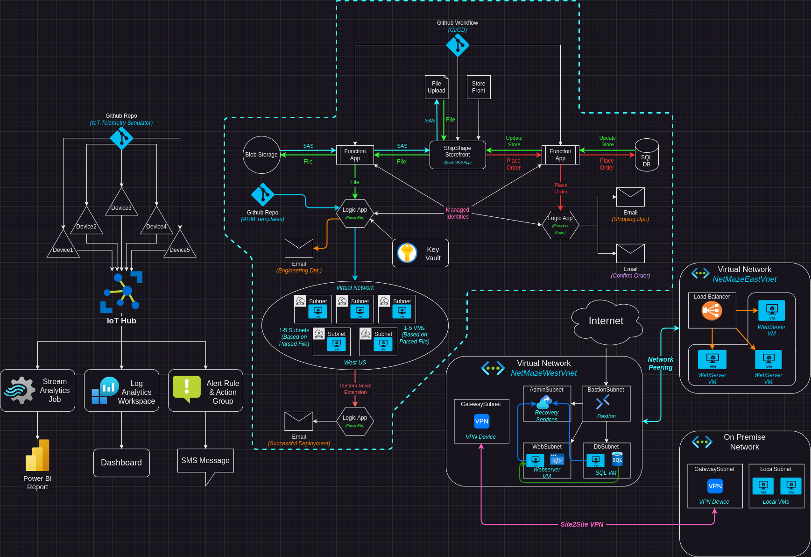

# Overview
In this section of my Azure Administration project I will be building the website for my fictional company, ShipShape. This section is the interface that space ship pilots will interact with to resupply and repair their ships. This will require them to upload their ship's status report as well as place orders for the supplies they need. 

In this section of my Azure Administration project I want to showcase and detail the setup and deployment of a Static Web utilizing Azure Functions, Logic Apps, SQL Server, and various other technologies. I want to get hands on experience with the skills learned and demonstrated in the [AZ-104 Azure Administration certification](https://learn.microsoft.com/en-us/credentials/certifications/azure-administrator/?practice-assessment-type=certification). This section will  focus on the *"Manage Azure identities and governance", "Implement and manage storage", "Deploy and manage Azure compute resources"* and *"Implement and manage virtual networking"* section of the exam. 
## Summary
The project starts with creating a website hosted in an Azure Static Web App. The website uses 2 Azure Functions as an API. The first function accepts a `.json` file upload. The file extension and MIME type are checked, and the file name is sanitized against path traversal and command injection attacks. The file is then uploaded into blob storage. An SAS URL is generated that allows anyone with the link to download the file for 1 day.

The file is also sent from the Function to a Logic App. The Logic App parses the `.json` file. If any values in the `"Repairs"` field are, a virtual network and network security group are deployed. Depending on which values are true in the `"Repairs"` field are true, between 1-5 Subnets and virtual machines are deployed using ARM templates stored in a Github repo. The VMs are allowed to be accessed over SSH only, and the public SSH key for each VM is stored in a Key Vault that gets accessed at runtime. Once the VMs are deployed they use the Custom Script Extension to execute a simple task.

The website also uses a separate Function to interact with an SQL database. When the storefront is loaded the function retrieves the current inventory numbers from the database and updates the site accordingly. When a use places an order, the corresponding SQL database entry gets decremented by the ordered amount and the the site gets updated in real time to reflect these changes. The Function also sends the order information to a Logic App that will send a confirmation email to the user, and order information to the shipping department.

Following the principal of least privilege, all of the Function and Logic Apps operate with managed identities. This also allows easy development by using the `azure-identity` python module to dynamically switch authentication methods between development and production environments

A Github Workflow is used to implement a CI/CD pipeline, so that when a change is pushed to Github, the Static Web App and Function App will be automatically updated with the changes.
### Technologies Used
- Azure Static Web Apps
- Azure Function Apps
- Azure Logic Apps
- Blob Storage
- Bicep & ARM deployment deployments
- Azure Key vault
- Custom Script Extension
- Github Workflows
- SQL Server & Database
- Managed Identities
- Azure Virtual Networks and Subnets
- Azure Virtual Machines
### Topology
The topology for this section of the project:

